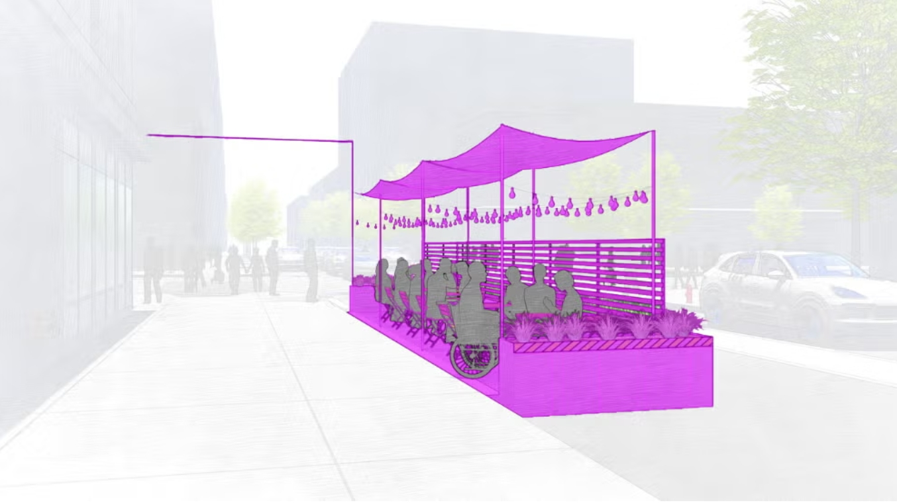
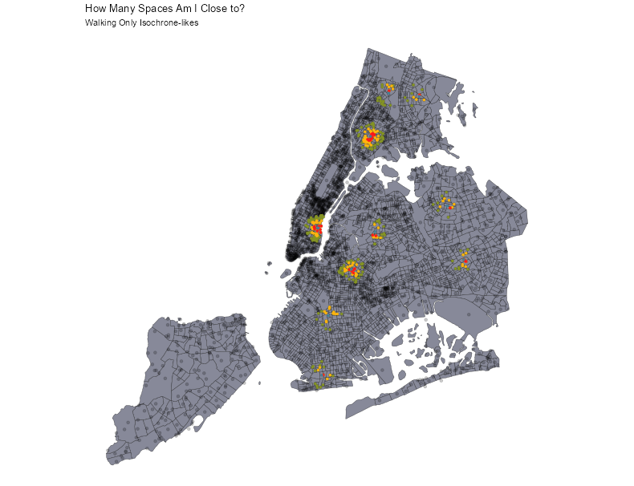
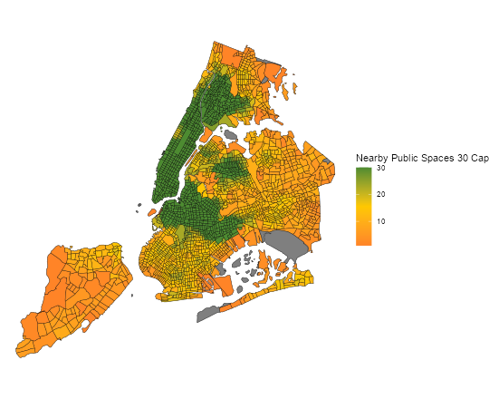
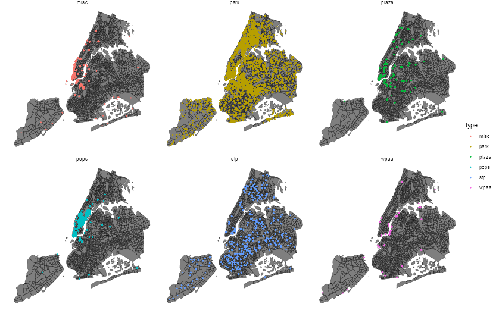
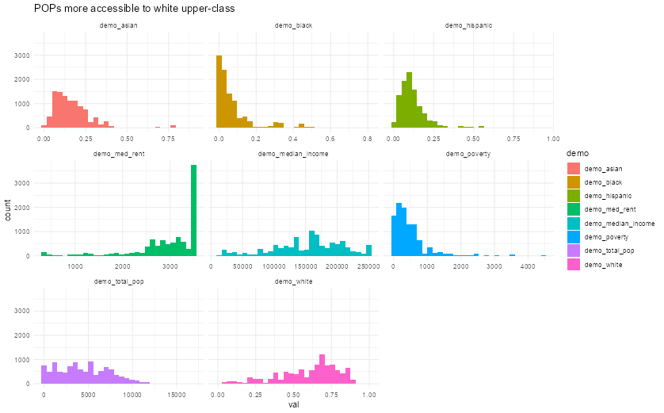
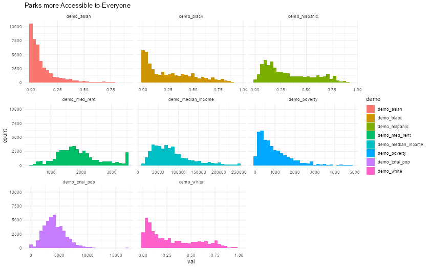

# Spatial Equitability Analysis of NYC Public Spaces

Try the interactive map here: https://javaelliott1.github.io/civic-analytics-map/

---

## A City Full of “Public” Space, But Not Equal Access

New York City is dense with parks, plazas, waterfronts, and privately owned public spaces (POPs). On paper, these places are “public.” In practice, access depends heavily on where you live, how you travel, and what surrounds you.

This project started with a simple question:

> If public space is meant for everyone, does everyone actually have the same ability to reach it?

To explore that, I built a citywide accessibility model that connects every census tract in NYC to nearby public spaces using travel time—not just distance.

---

## What It Means to Be “Close” in NYC

The first step was to stop thinking in abstract maps and start thinking in lived experience:

> What does it actually mean for something to be “nearby”?

For every census tract, I used its centroid as a stand-in for where people live. From there, I measured how far someone could realistically travel to reach public spaces within:

- 10 minutes  
- 20 minutes  
- 30 minutes  

And using two modes:

- Walking  
- Walking + transit  

Each tract becomes a kind of “origin point” in the city, radiating outwards into what is actually reachable.

Even at this early stage, a pattern emerges: NYC is not evenly reachable. The city bends accessibility around infrastructure, water, bridges, and transit lines. “Nearby” is not a neutral concept—it is shaped by the city itself.

---

## From Individual Access to Citywide Patterns

Once every tract has a view of what it can reach, the next step is to ask a broader question:

> Which neighborhoods have more public space within reach?

To approximate this, I created a simple but revealing rule:

- 10 reachable spaces within 10 minutes  
- 20 within 20 minutes  
- 30 within 30 minutes  

This becomes a rough proxy for “public space abundance.”

### The 30-for-30 View

At first glance, the result is almost expected: dense areas see more accessible public spaces.

But that “obvious” result hides something important. Density is doing a lot of work here—it compresses space, infrastructure, and amenities together. Still, it doesn’t explain *what kinds* of public spaces are accessible, or how that access differs across the city.

---

## Public Space Types

When we separate public spaces into categories, the city stops looking uniform.

Parks dominate the visual landscape—they are widespread, familiar, and deeply embedded in NYC’s geography. But other types of public space tell a different story.

- POPs cluster in commercial and high-income corridors  
- Waterfront access is uneven and geographically constrained  
- Plazas often follow development patterns rather than neighborhood need  
- Schoolyards open to the public appear in more localized, conditional patterns  

Once we break things apart, a key insight emerges:

> Aggregated access can hide unequal types of access.

A neighborhood might appear well-served overall, while still lacking certain kinds of public space entirely.

---

## POPs vs Parks: An Implicit Divide

To understand this more deeply, I paired spatial access with demographic data from the 2024 American Community Survey (ACS), assuming stable population distribution over recent years.

Then I compared two categories:

- Privately Owned Public Spaces (POPs)  
- Parks  

### POPs

### Parks

The contrast is difficult to ignore.

POPs are heavily concentrated in and around Manhattan’s high-income areas—especially the Financial District and select Midtown corridors. Parks, by comparison, are more geographically distributed and serve a wider demographic mix.

This raises a set of uncomfortable but necessary questions:

- Who are POPs actually designed for?
- Are they meaningfully “public” in practice?
- Do they expand access—or reinforce existing patterns of wealth and development?

Public space here is not just infrastructure. It reflects decision-making, incentives, and whose presence the city is designed to accommodate.

---

## How the Map Works Behind the Scenes

The interactive app is designed for fast exploration, not real-time routing.

Instead of calculating routes on demand, it uses **precomputed travel-time relationships** between census tracts and public spaces.

When a user clicks on the map:

1. The nearest census tract is identified  
2. That tract is highlighted  
3. Public spaces are filtered by:
   - travel mode  
   - time threshold  
   - space type  
4. Nearby spaces are displayed instantly  
5. A sidebar updates with:
   - total reachable spaces  
   - tract ID  
   - breakdown by type  
   - nearest locations  

The result is a responsive way to explore accessibility without the cost of live routing computation.

The map is also intentionally bounded to NYC to keep the analysis grounded in a single urban system.

---

## What This Leaves Out (and Why It Matters)

Like any model, this one simplifies reality in order to make it visible.

Key limitations:

- Accessibility is measured from tract centroids, not individual homes  
- No live routing is performed in the browser  
- All public spaces are treated equally, regardless of size, safety, quality, or hours  
- Travel times are based on a fixed dataset snapshot (January 3rd, 2026)  

These choices make the system fast and interpretable—but they also flatten important lived differences in how public space is experienced.

---

## Where This Could Go Next

This project is less a finished answer and more a starting point.

Future directions could include:

- weighting spaces by quality, size, or usage patterns  
- adding time-of-day and weekend variation  
- integrating real routing APIs for finer-grained accuracy  
- incorporating demographic change over time  
- distinguishing between formal access and perceived safety or usability  

---

## Closing

Public space is often described as something everyone shares equally.

But when you map it—really map it—what emerges is something more uneven:

a city where “public” is real, but not always equally reachable.